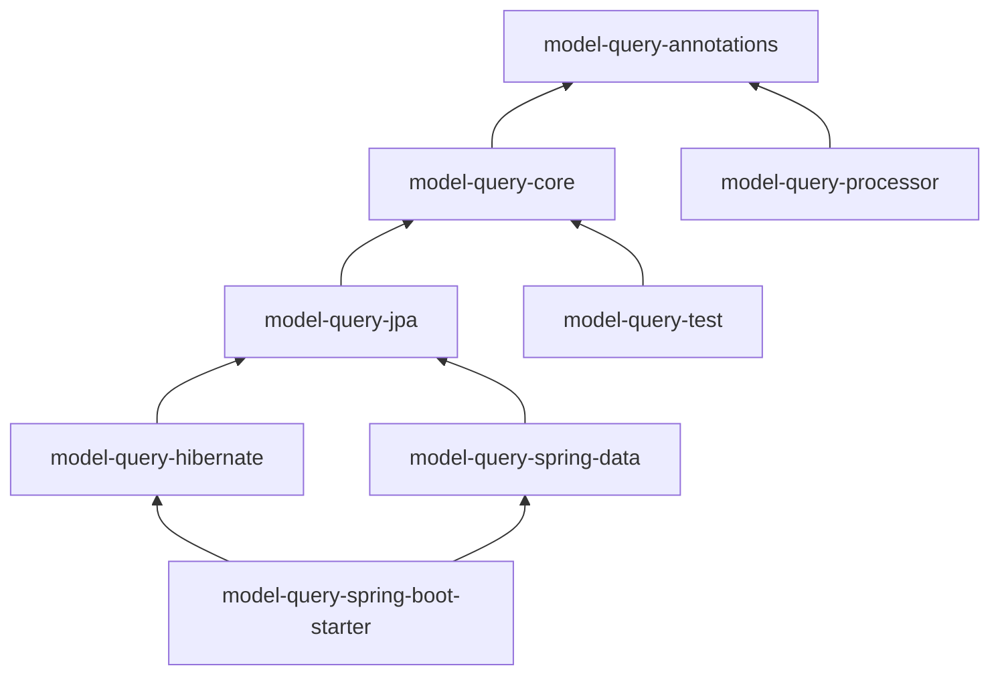
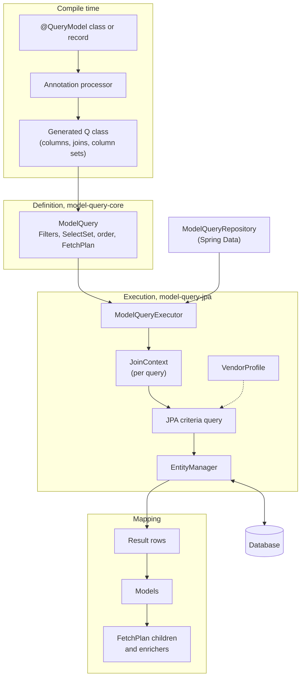

# Architecture

How the modules fit together, and what happens between a query definition and the models it returns.

## Modules

Dependencies flow one way. `core` knows nothing about the executor, and nothing below the starter knows about Spring
Boot, so every feature works with a plain `EntityManager`.

| Layer | Modules | Role |
|---|---|---|
| Compile time | `annotations`, `processor` | You annotate a model; the processor generates its `Q` class |
| Definition | `core` | Immutable query definitions: columns, joins, filters, select sets, fetch plans, enrichers |
| Execution | `jpa`, `hibernate` | The executor turns a definition into JPA criteria, pages, streams, exports and bulk writes |
| Integration | `spring-data`, `spring-boot-starter` | `ModelQueryRepository` and auto-configuration; no behaviour of their own |
| Testing | `test` | Assertions over a recorded `ModelQuery`, without a database |

## From a model to a result

1. **Compile time.** The processor reads each `@QueryModel` and generates a `Q` class with one typed constant per
   column, join and column set. A column's Java type is checked against the entity attribute and the model field.
2. **Definition.** A `ModelQuery` combines `Q` constants with a `Filters` tree, a select set and an order. Definitions
   are immutable and thread-safe, so they can be `static final` and shared.
3. **Execution.** The `ModelQueryExecutor`, called directly or through a `ModelQueryRepository`, resolves joins in a
   per-query `JoinContext` and builds a JPA criteria query that selects only the declared columns. Values are always
   bind parameters.
4. **Vendor behaviour.** Every database difference, such as null ordering, streaming or bulk-write strategy, sits
   behind a `VendorProfile`. H2, PostgreSQL and MySQL profiles are built in; see [vendor notes](vendors.md).
5. **Mapping.** Each result row becomes a plain model; nothing returned is a managed entity, and queries never write.
   A fetch plan then loads child collections and runs enrichers once per page, not once per row; see
   [fetch plans](fetch-plans.md).

## Paging and export

The same definition runs as `list`, `page`, `count`, `stream` or `export`. Offset, keyset and primary-key-first
paging are strategies inside the executor. An export visits every row exactly once, with memory bounded by one page;
see [paging and export](paging-export.md).
