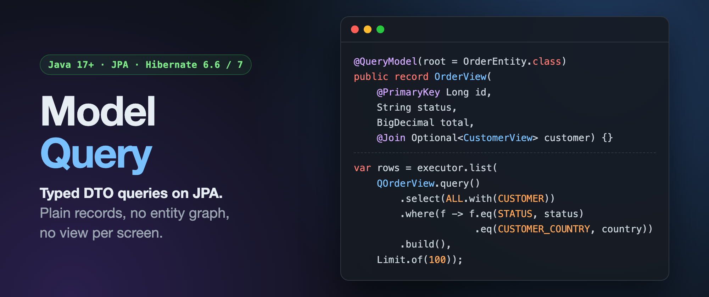

# Model Query

Typed, projection-first queries on top of JPA. You describe a result as a plain class or record, and the library
selects exactly those columns, applies your filters, and maps rows straight into the model, with no entity loading.

- **Models and QModels.** An annotation processor reads your model and generates a `Q` class with a typed constant per
  column, join and column set.
- **A query engine** for `list`, `page`, `count`, `stream` and large `export`, with offset, keyset and primary-key-first
  paging.
- **A `Filters` DSL** where an empty `Optional` skips a filter, values are always bind parameters, and negation includes
  NULLs.
- **Grouped queries** with typed aggregates and `having`.
- **Bulk updates and deletes** driven by the same filters (`@Incubating`; see [API stability](stability.md)).
- **Vendor-aware behaviour** for H2, PostgreSQL and MySQL, behind an SPI other databases can implement.
- **Spring Data and Spring Boot** integration that adds no behaviour of its own: everything also works with a plain
  `EntityManager`.

## Modules

| Artifact | Contents |
|---|---|
| `model-query-bom` | Version alignment for all modules |
| `model-query-annotations` | `@QueryModel`, `@PrimaryKey`, `@Column`, `@Join`, `@FilterColumn`, `@UpdateModel`, ... |
| `model-query-core` | Columns, tables, column sets, rows, queries, the filters DSL and SPIs |
| `model-query-jpa` | The executor, paging and export engine, and the built-in vendor profiles |
| `model-query-hibernate` | Hibernate extras: dialect-based vendor detection, grouped count, null precedence |
| `model-query-processor` | The annotation processor that generates `Q` classes |
| `model-query-spring-data` | `ModelQueryRepository` and the Spring Data `Pageable`/`Sort` adapters |
| `model-query-spring-boot-starter` | Spring Boot auto-configuration and the `modelquery.*` properties |
| `model-query-test` | AssertJ assertions over recorded queries, for unit tests without a database |

See [Architecture](architecture.md) for how the modules depend on each other and how a query runs.

## Where to go next

1. Getting started [without Spring](getting-started/plain-jpa.md) or
   [with Spring Boot](getting-started/spring-boot.md).
2. [Models and QModels](models.md), then [queries and filters](queries.md).
3. [Paging and export](paging-export.md) before you export anything large.
4. [Vendor notes](vendors.md) for what differs between H2, PostgreSQL and MySQL.
5. [Diagnostics](diagnostics.md) when you meet an `MQnnnn` code.

## Requirements

Java 17+, Jakarta Persistence 3.1+, Hibernate ORM 6.6+ (tested on 6.6 and 7.x), and Spring Boot 3.4+ for the starter.
